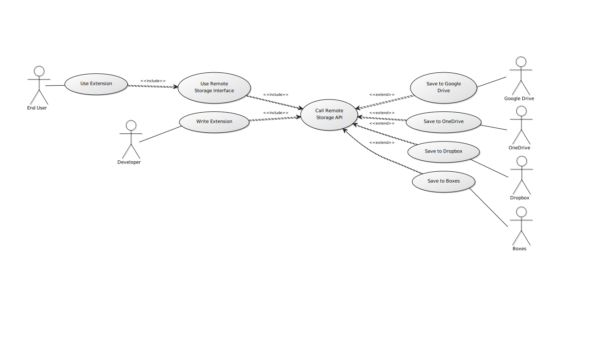

# OO Design & UML
## Use Case UML Diagram

This use case UML diagram outlines the key actors in the application, namely the developer of some future extension, the cloud storage providers, and the end user. This was created to give a simple, high-level overview of how the API should work once built, as it may not be immediately obvious with three groups of actors accessing different aspects of the API.

## Class Diagram

#### Component Explanation
Above is a more detailed class diagram, breaking down the API application into its core components and how they should interact with each other. Starting with the manifest.json, this is the base file required by all Firefox extensions and provides key metadata about the API extension such as name, version and permissions required. It also points to other files used by the extension, which in this case are main.js, popup.css and popup.html; the first being the core program of the application and the two latter files being used to display a popup window that the user can interact with.
The main.js file should be able to add and remove cloud storage locations by creating instances of cloud.js for a specified provider. This object will also hold a login token used to authenticate the user when calls to store/read data are made. The developer of a new extension can then request to use this cloud storage through calls made to the exposed api.js without needing to interact with any other part of the API extension.

#### Diagram Context

While this class diagram does not strictly show only objects in a singular program, it does show the structure of a typical Firefox extension and the files associated with one. It could prove extremely useful to have something that gives a general overview of the core components of the application, yet being more specific than a simple use case diagram that focuses mainly on users. This should help to divide up the work that needs to be done by breaking things down and giving clear indication of which files / functions each object should access.
