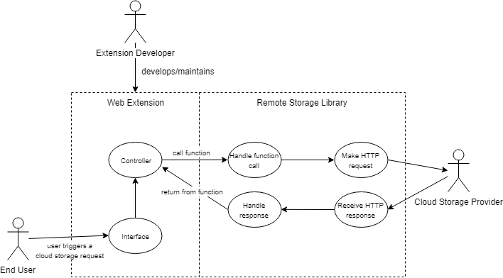

# Requirements
## Stakeholders 
- **Browser extension users**: The final users of our product, being used as a library within web extensions.
- **Cloud providers**: Provide the cloud-storage services that our API will interface with.
- **Extension developers**: Direct users of the API when developing extensions that interact with it.
- **Rob Wu** and **Luca Greca**: Project directors, providing support and guidance during development of the product.
- **Mozilla**: Company responsible for the WebExtensions APIs and that requested this product be developed.

## Use-case Diagram

-----------------------------------------

## Flow Steps
### Authenticating with a cloud provider
#### Basic flow
1. User selects a cloud provider.
2. Extension calls the authentication function for that provider.
3. Sign-in popup appears, user enters their details.
4. User grants permissions for the extension to access their cloud storage.
5. The authentication token is received.
6. The token is validated.
7. Authentication function returns successfully. 

#### Alternative flows
If the user has already authorised the extension previously, skip step 4. 
If the user still has a valid session with the cloud provider, skip steps 3 and 4.

#### Exceptional flows
If the token fails to verify at step 6, return unsuccessfully. 
If the user closes the sign-in popup during steps 3-4, return unsuccessfully. 
if the user chooses not to grant the required permissions at step 4, return unsuccessfully.

-----------------------------------------

### Storing a file to a cloud
#### Basic flow
1. Follow the authentication flow above.
2. User selects a file to upload.
3. The extension passes this file to the upload function.
4. The library sends the upload request to the cloud provider.
5. The cloud provider responds with successful file creation.
6. The upload function returns successfully.

#### Exceptional flow
If the upload request fails for any reason, return unsuccessfully with the error code.

-----------------------------------------

### Deleting a file from a cloud
#### Basic flow
1. Follow the authentication flow above.
2. User selects a file from the cloud storage to delete.
3. The extension passes the file name to the delete function.
4. The library sends the delete request to the cloud provider.
5. The cloud provider responds with successful file deletion.
6. The delete function returns successfully.

#### Exceptional flow
If the file already doesn't exist, return unsuccessfully with an error.

-----------------------------------------

### Fetching a file from a cloud
#### Basic flow
1. Follow the authentication flow above.
2. User selects a file from the cloud storage to download.
3. The extension passes the file name to the download function.
4. The library sends the download request to the cloud provider.
5. The cloud provider responds with the file contents.
6. The download function returns successfully with the file contents.

#### Exceptional flow
If the download request fails for any reason, return unsuccessfully with the error code.

-----------------------------------------

## Requirements
### Functional Requirements
**RS-1.1**  *Must* be implemented as a JavaScript library. 
**RS-1.2**  *Must* provide a function to **authenticate** with a specified cloud provider. 
**RS-1.3**	*Must* provide a function to **upload** a file to the cloud storage with a given file name. 
**RS-1.4**	*Must* provide a function to **download** a file from the cloud storage given the file name. 
**RS-1.5**	*Must* provide a function to **delete** a file to from the cloud storage given the file name. 
**RS-1.6**  *Must* prevent extensions from interfering with the user's own files on the cloud storage. 
**RS-1.7**  *Must* prevent extensions from interfering with files from other extensions on the cloud storage. 
**RS-1.8**	*Must* allow storing more than the 5MB limit currently offered by the `storage.local` API. 
**RS-1.9**	The interface provided by the library *should* be entirely cloud-provider independent. Any differences between providers should be handled by the library. 

### Non-Functional Requirements
**RS-2.1**	*Should* make use of modern ES6+ JavaScript features, specifically `async`, `await` syntax. 
**RS-2.2**  *Should* have well-commented code to ease future development. 
**RS-2.3**  *Should* be well tested. 
**RS-2.4**  How to run and write tests *should* be well documented. 
**RS-2.5**	*Should* include documentation detailing how to make use of the library. 
**RS-2.6**	*Should* make the minimum number of HTTP requests needed to implement the desired functionality. 
**RS-2.7**	*Should* require as few extension permissions as possible to operate. 

